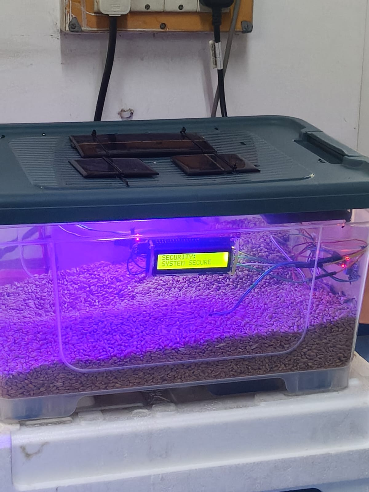
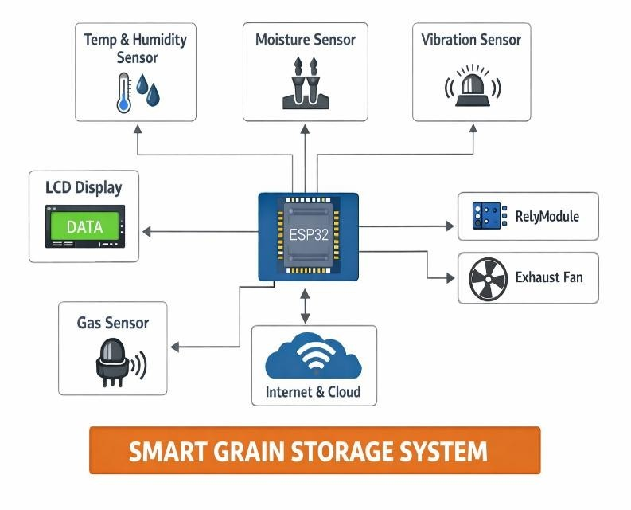
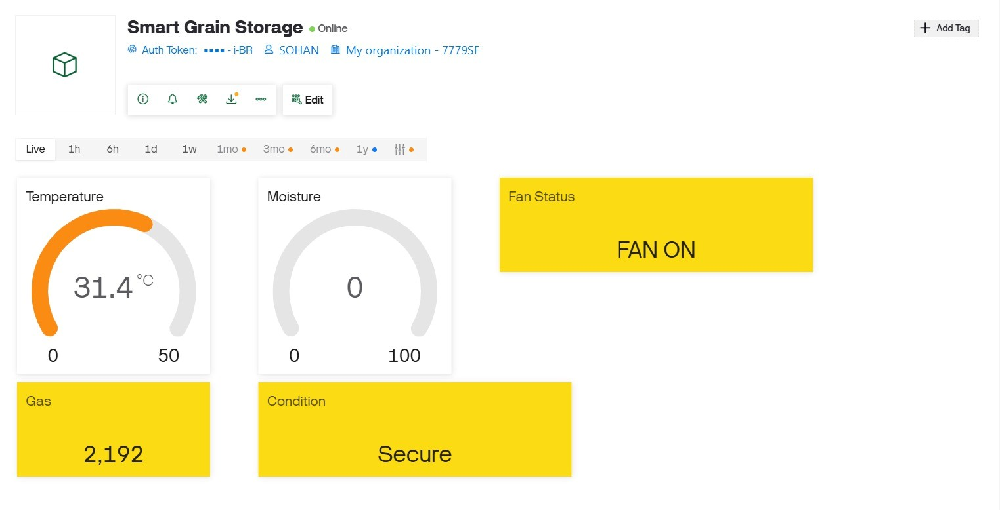
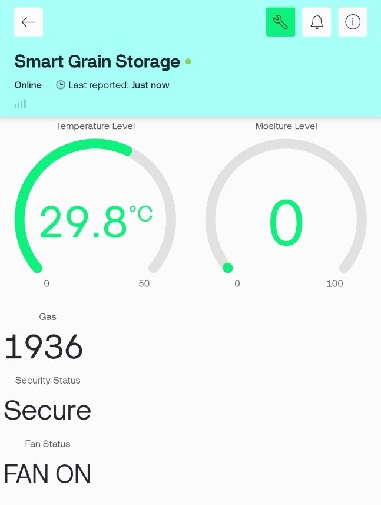

# Smart-Grain-Storage-System
ESP32-based IoT system for real-time grain storage monitoring

## 📌 Project Overview
This system monitors grain storage conditions in real-time using ESP32 and IoT sensors to detect temperature, humidity, and moisture levels.

## 🛠️ Components Used
- ESP32 Microcontroller
- Temperature & Humidity Sensor (DHT11/DHT22)
- Moisture Sensor
- LCD Display
- Blynk IoT App (Mobile Dashboard)
- Buzzer (for alerts)

## 📷 System Photo

## 🔌 Circuit Diagram

## 📲 Blynk Dashboard

## 📊 Output

## ⚙️ How It Works
1. Sensors collect real-time data
2. ESP32 processes the data
3. Alerts/notifications triggered if values exceed safe limits
4. Data is displayed on LCD /  Data is sent to **Blynk IoT cloud**
5. You can monitor readings live on the **Blynk mobile app**
